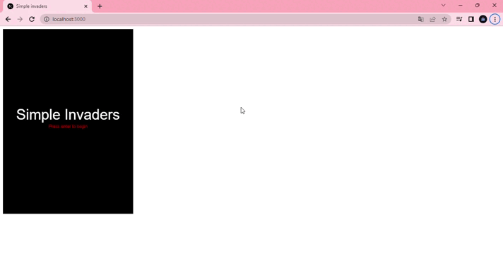
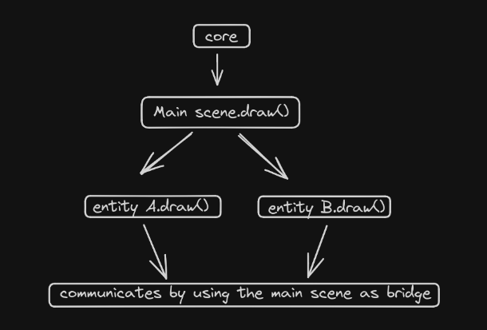

# Simple invaders

Simple invaders is a little sample game made with bare javascript and
using the canvas api to display content in the web page.



Internally, the "framework" which i've implemented, uses the next scheme
as reference for communication of each elements:



## Local deployment

You can use the next commands as reference:

```sh
git clone https://github.com/alphatechnolog/simple-invaders.git simple-invaders
npm install -g serve
cd simple-invaders
serve -s .
```

Or if you want to use a simple approach for serving the web page,
you could try by using python.

```sh
python -m http.server 8000
```

Then just open a web browser and go to [localhost:8000](http://localhost:8000)